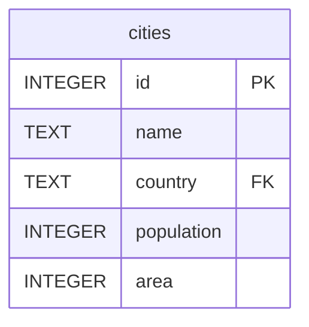

# DATABASE DESIGN

Basic questions:

1. What **thing** are we storing?
2. What **properties** are we storing?
3. What **type** are those properties?

Example:

```mermaid
erDiagram
    cities {
        INTEGER id PK
        TEXT name
        TEXT country FK
        INTEGER population
        INTEGER area
    }
```