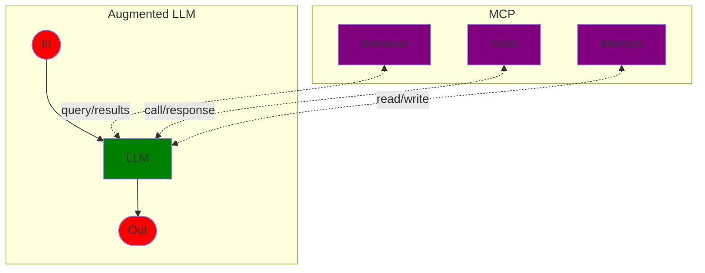
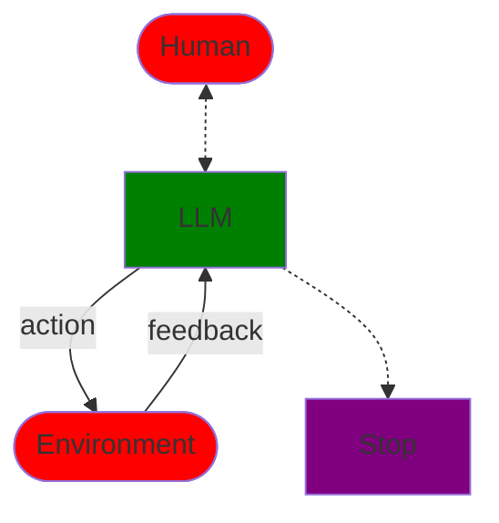

# Building Effective Agents

### Two systems

1. Workflows - systems where the LLMs are orchestrated along a predetermined route to a result
2. Agents - systems where the LLMs have the autonomy to select tools and the autonomy on how to solve a problem

### Basic building block

The basic building block is an **augmented LLM**.



### Workflows

1. Chaining
    - decomposes a task into a steps, each solved by an LLM
    - can have gates as checkpoints
    - When:
        - when a task can cleanly be split into subtasks
        - the goal is to make subsequent steps easier
    - Examples:
        - outline -> content -> translation
    ```mermaid
        graph LR
            in([In]) --> llm1[LLM 1] --> |output 1| gate[Gate] -->|pass| llm2[LLM 2] --> out([Out])
            gate .->|fail| exit([Exit])

            classDef io fill:red
            class in,out,exit io

            classDef llm fill:green
            class llm1,llm2 llm

            classDef other fill:purple
            class gate other
    ```

2. Routing
    - routing passes the task to a specialized LLM
    - allows for optimization of specific LLMs
    - When:
        - distinct categories of tasks
        - accurate categorization
    - Examples:
        - customer care: general questions, payments, technical support
        - complexity: simple for Haiku, hard for Sonnet, coding for Opus
    ```mermaid
        graph LR
            in([In]) --> llmRouter[LLM Router] --> llm1[LLM 1] --> out([Out])
            llmRouter .-> llm2[LLM 2] .-> out
            llmRouter .-> llm3[LLM 3] .-> out
        
        classDef llm fill:green
        class llmRouter,llm1,llm2,llm3 llm

        classDef io fill:red
        class in,out io
    ```

3. Parallel

   A. Sectioning
      - Task -> subtasks, execute in parallel
      - Faster
      - Complex -> focus on specific subtask
      - When: implement multiple classes at once

   B. Voting
      - Same task multiple times -> various outputs -> voting
      - When: rankable output, high accuracy required
    ```mermaid
        graph LR
            in([In]) --> llmRouter[LLM Router] --> llm1[LLM 1] --> aggregator[Aggregator] --> out([Out])
            llmRouter --> llm2[LLM 2] --> aggregator
            llmRouter --> llm3[LLM 3] --> aggregator
        
        classDef llm fill:green
        class llmRouter,llm1,llm2,llm3 llm

        classDef io fill:red
        class in,out io

        style aggregator fill:purple
    ```

4. Orchestrator
    - orchestrator breaks a task into subtasks and delegates to LLMs
    - the subtasks are unknown -> similar to parallel but more flexible
    ```mermaid
        graph LR
            in([In]) .-> orchestrator[Orchestrator] --> llm1[LLM 1] --> synth[Synthesizer] --> out([Out])
            orchestrator .-> llm2[LLM 2] --> synth
            orchestrator .-> llmn[LLM n] --> synth
        
        classDef llm fill:green
        class orchestrator,llm1,llm2,llmn llm

        classDef io fill:red
        class in,out io

        style synth fill:purple
    ```


5. Evaluator-Optimizer
    - one LLM generates a solution while another gives evaluation
    - When
        - clear criteria
        - iterative refinement clearly improves the solution
    - Examples
        - complex search and analysis - multiple rounds; evaluator decides whether to do more
    ```mermaid
        graph LR
            in([In]) --> generator[Generator] -->|solution| evaluator[Evaluator] -->|accepted| out([Out])
            evaluator -->|rejected + feedback| generator

            classDef llm fill:green
            class generator,evaluator llm

            classDef io fill:red
            class in,out io
    ```

### Agents
1. Discussion
2. Execution - plan and operation independently
3. Check-up

- agents require environment feedback - running tools, executing code.
- better documentation and tool design - better output
- When
    - open ended problems - don't know subtasks, don't know the path

