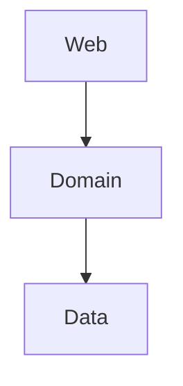

# WHAT'S WRONG WITH LAYERS

Traditional layered architecture:

They work with strict discipline.

The big issue is that this architecture is very data-layer biased:

- web depends on the domain, the domain depends on the data → DB is the foundation
- prone to putting everything inside data: 
    - ORM lives in data → easy shortcut to mix domain and data
    - layered arch requires downward dependency → easy shortcut to put something down a layer when we need something from above
- prone to skipping the domain layer
    - we have to mock both domain and data layers → more complex testing sometimes leads to less testing
- prone to spreading the domain logic - some live in the web, some live in the data (because we put it down a layer)
    - harder to see the usecases at a glance

These things lead to these issues:
- wrong way to think about logic - we should model behavior, because behavior changes state
- tighter coupling with the data layer
- harder to test due to domain logic spread
- harder to work in parallel

