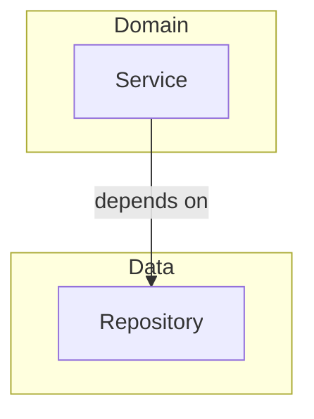
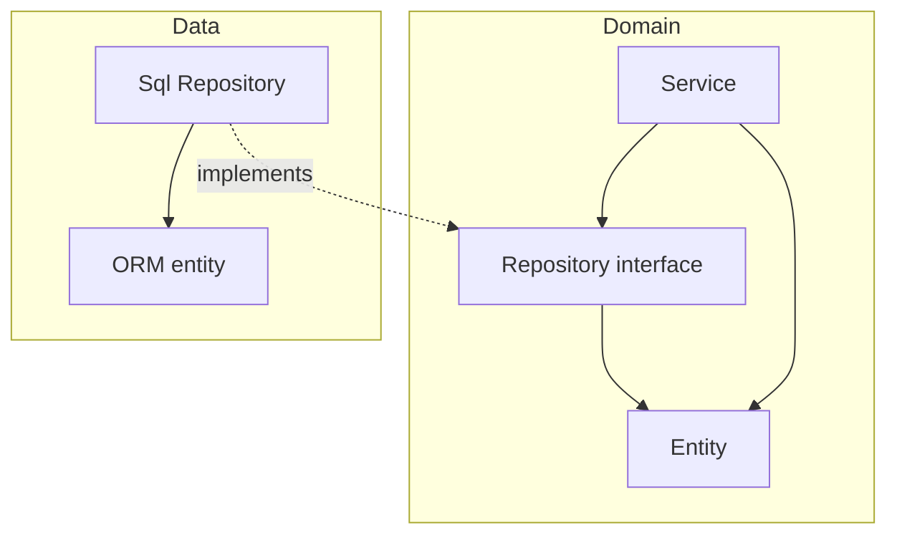

# CORE PRINCIPLES

### Single Responsibility

Every component has only one reason to change.

- this means that we if we change the app for any other reason, then the changes should not affect that component

### Dependency Inversion Principle

Traditional dependency direction: 

- domain layer depends on the data layer → change to data layer requires change to domain layer
  - domain layer has more reasons to change

Flipped:

- interface
  - allows us to make data dependent on domain
  - isolates the domain from data changes

### Clean architecture

- all dependencies between layers must point inward
- domain code doesn't have any dependencies on frameworks, it focuses purely on business logic
  - this means we're free to model our domain however we want, for example DDD
- cost - we have to maintain a model of entities in each of our layers
  - various mapping strategies, including no-mapping strat (we use the domain entity)

### Hexagonal arch

DDD flavored hexagonal diagram:

- application core is the hexagon
  - no outgoing dependencies; all dependencies point inward
  - domain - business logic
  - ports
      - the interface between the adapters and the application core
      - in - aka use cases; implemented by our service 
      - out
          - implemented by the adapter, called by our application core
          - can have multiple implementations - ie real and mock
- outside the hexagon
  - adapters
    - in (driving) - call our application core 
    - out (driven) - called by our application core