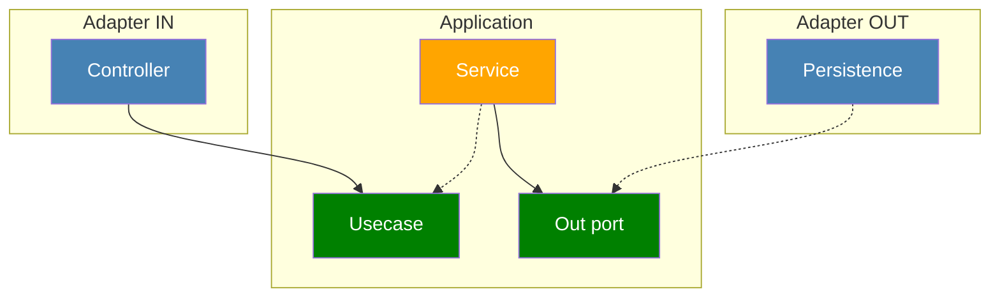

# CODE ORGANIZATION

### Organization by layer

```
project
├── domain
│   ├── <Entity>
│   ├── <RelatedEntity>
│   ├── <EntityRepository>
│   └── <EntityService>
├── persistence
│   └── <EntityRepositoryImpl>
└── web
    └── <EntityController>
```

- given all the negatives about organizing by layer, this is not optimal
- on top of that
  - no boundary between any slices
  - usecases aren't clearly visible
  - the architecture isn't clearly visible

### Organization by feature

```
project
└── feature
    ├── <Entity>
    ├── <FeatureController>
    ├── <EntityRepository>
    ├── <EntityRepositoryImpl>
    └── <FeatureService>
```

- better cohesion
- the architecture even less visible - can't see adapters or ports
- can't enforce package privacy

### Hexagonal organization

```
project
├── account
│   ├── adapter
│   │   ├── in
│   │   │   └── web
│   │   │       └── SendMoneyController (calls SendMoneyUseCase)
│   │   └── out
│   │       └── persistence
│   │           ├── AccountPersistenceAdapter: UpdateAccountStatePort
│   │           └── SpringDataAccountRepository
│   └── application
│       ├── domain
│       │   ├── model
│       │   │   └── Account
│       │   └── service
│       │       └── SendMoneyService: SendMoneyUseCase (uses UpdateAccountStatePort, uses fraud.CheckTransactionUseCase)
│       └── port
│           ├── in
│           │   └── SendMoneyUseCase (interface)
│           └── out
│               └── UpdateAccountStatePort (interface)
└── fraud
    ├── adapter
    │   ├── in
    │   │   └── web
    │   │       └── FraudCheckController (calls CheckTransactionUseCase)
    │   └── out
    │       └── http
    │           └── FraudApiAdapter: FraudScorePort
    └── application
        ├── domain
        │   ├── model
        │   │   └── FraudReport
        │   └── service
        │       └── CheckTransactionService: CheckTransactionUseCase (uses FraudScorePort)
        └── port
            ├── in
            │   └── CheckTransactionUseCase (interface)
            └── out
                └── FraudScorePort (interface)
```

- clear mapping of architecture elements to the packages
- screaming packaging
- `adapter/in` 
  - in Spring, they'd be triggered by the framework
  - outside of BE, something like ViewModel would be the in-adapter and they'd be placed somewhere else
- `application` contains the hexagon

### Dependency



- implementation for an interface is provided by DI